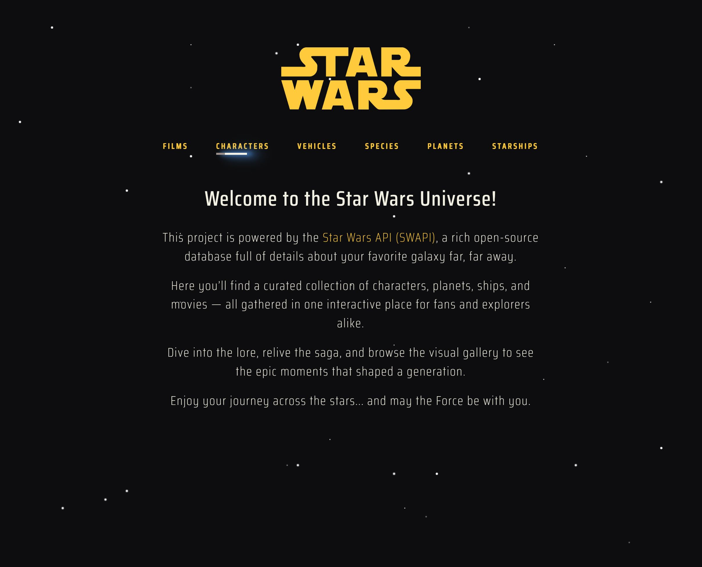

# Star Wars Universe

**Star Wars Universe** is an interactive web app built with React and powered by the [Star Wars API (SWAPI)](https://swapi.py4e.com/). It offers an engaging experience for fans and explorers to dive into the lore of a galaxy far, far away.

## ✨ Features

- 🌌 Explore characters, planets, species, and films from the Star Wars universe.
- 🔍 Search and filter entities with ease.
- 🖼️ Visual gallery with local images for each category.
- 🎯 Smooth navigation between related entities.
- 🎨 Highlighted active categories and dynamic UI.
- 🚀 Scrolls to top automatically when navigating between categories.

## 🛠️ Tech Stack

- **React**
- **React Router**
- **Tailwind CSS**
- **SWAPI (Star Wars API)**

## 📦 Installation

1. Clone the repository:

```bash
git clone https://github.com/your-username/star-wars-universe.git
cd star-wars-universe
```

2. Install dependencies:

```bash
npm install
```

3. Run the app locally:

```bash
npm run dev
```

The app will be available at [http://localhost:5173](http://localhost:5173)

## 🌍 API

This project uses [SWAPI](https://swapi.py4e.com/), a free and open-source RESTful API that provides detailed information about the Star Wars universe.

## 📸 Preview




## 🙌 Acknowledgements

- [SWAPI](https://swapi.py4e.com/) for the data.
- The Star Wars saga for the timeless inspiration.

## 🧑‍🚀 Author

Made with ❤️ by **Li Aguaviva**  
[Portfolio](https://li_aguaviva.artstation.com)

---

> May the Force be with you ✨
